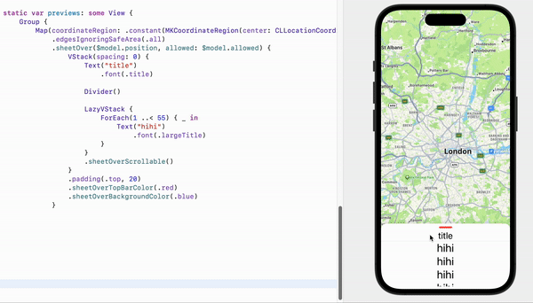

# SheetOver

## Feature

* Customable Bottom sheet



## Uasge

```swift
// current position
@State var position: SheetOver.Position = .short()
// stop position when dragging stopped
@State var allowed: [SheetOver.Position] = [.tall(scrollable: true), .half(), .short()]
```

```swift
SomeView()
	.sheetOver($model.position, allowed: $model.allowed) {
			VStack(spacing: 0) {
					Text("title").font(.title)

					Divider()

					LazyVStack {
							ForEach(1 ..< 55) { _ in
									Text("hihi")
											.font(.largeTitle)
							}
					}
					// scroll at .tall because .tall(scrollable: true) at allowed
					// or just false for long contentSize.height
					.sheetOverScrollable()
			}
			.padding(.top, 20)
			.sheetOverTopBarColor(.red)
			.sheetOverBackgroundColor(.blue)
	}
```
